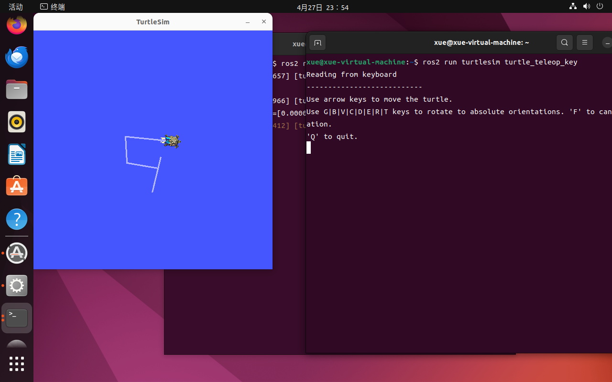
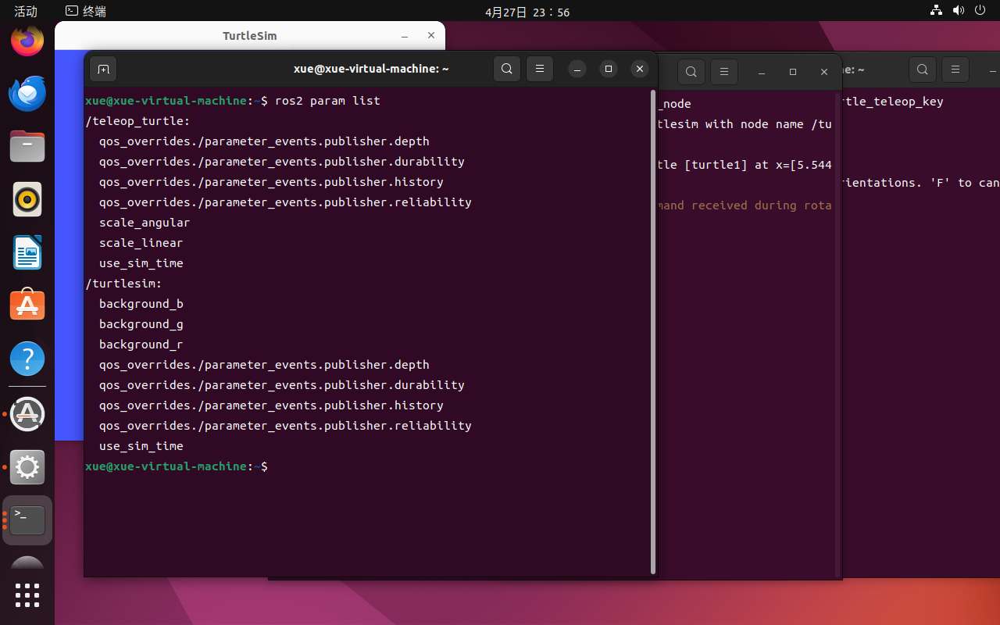
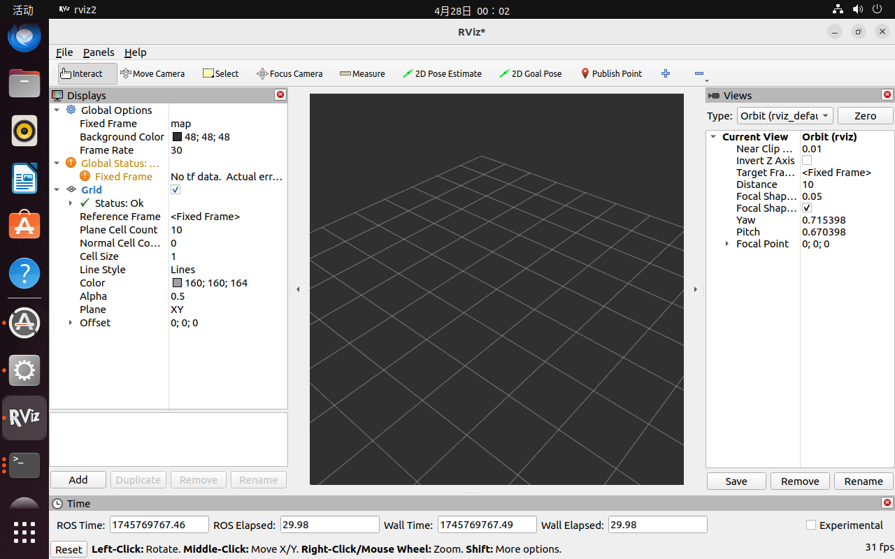

第二周主要学习内容（4.21-4.27）
#### 使用gcc编译ROS节点
- 预处理
- 编译
- 汇编
- 连接
由源文件生成可执行文件
使用g++编译ROS的C++节点`g++ name.cpp`
#### ROS通讯方式
- 节点Node（执行单元）
    - 执行具体任务进程、独立运行可执行文件
    - 节点名称唯一
- 节点管理器Master（控制中心）
    - 为节点提供命名和注册服务
- 话题Topic（异步通信处理机制）
    - 节点间通过话题来传输数据
    - 通过发布/订阅来传递消息
    - 多对多方式
- 消息Message
    - 话题的一种数据，格式为.msg
- 服务Service（同步通信处理机制）
    - 使用客户端/服务器模型，客户端发送请求数据，服务器完成处理后返回数据,格式为.srv
    - 一对多方式
- 参数Parameter（全局共享字典）
    - 节点的一个配置值，可以通过网络访问的多变量字典
- 功能包Package
    - 包含节点源码
#### 节点间通讯

#### 加载ROS节点参数列表

#### 修改ROS节点参数
`ros2 param set <node_name> <parameter_name> <value>`
#### 启动可视化工具Rviz2

本周目标
- 了解C++ Google Guide风格代码编写
- 完成git仓库管理和上传