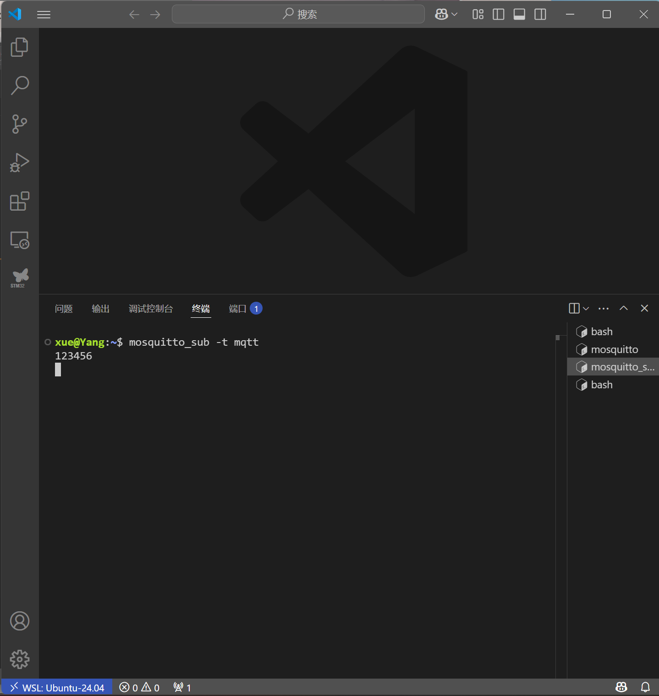

### MQTT
- MQTT是一种基于发布/订阅模式的“轻量级”通讯协议，构建与TCP/IP协议上。主要是用于低带宽、高延迟、不稳定的网络环境，使传感器与执行器之间进行高效通讯。
- MQTT协议中有三种身份：发布者、代理服务器、订阅者。
- 发布者将数据发布到一个特定的主题，服务器接收到消息后将其转发给订阅了相应主题的订阅者。
### 搭建MQTT服务器
- 安装MQTT服务器.
- 搭建代理服务器端
- 搭建发布端
- 搭建订阅端
可以正常实现通信