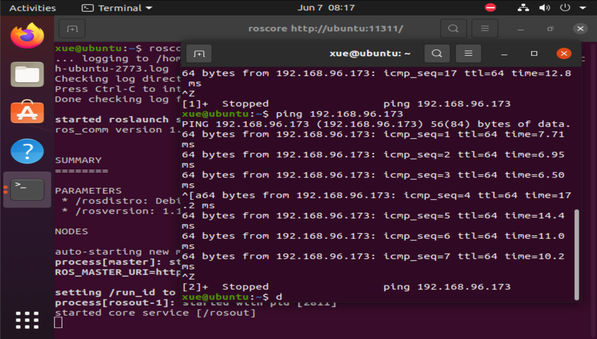

## ROS
- 配置ROS环境`wget http://fishros.com/install -O fishros && . fishros`
### 主从机配置
- 查询主从机的hostname和IP地址
`ifconfig`
- 修改hosts文件，添加主机与从机的IP与主机名
`sudo gedit /etc/hosts`
- 环境变量配置
`sudo gedit ~/.bashrc`
主机在末尾添加`export ROS_MASTER_URI=http://主机名:11311
export ROS_HOSTNAME=主机名`
从机在末尾添加`export ROS_MASTER_URI=http://主机名:11311
export ROS_HOSTNAME=从机名`
- 开启roscore
- 测试环节
使用`ping`测试主从机连通情况

### 注意事项
- 从机不要运行roscore