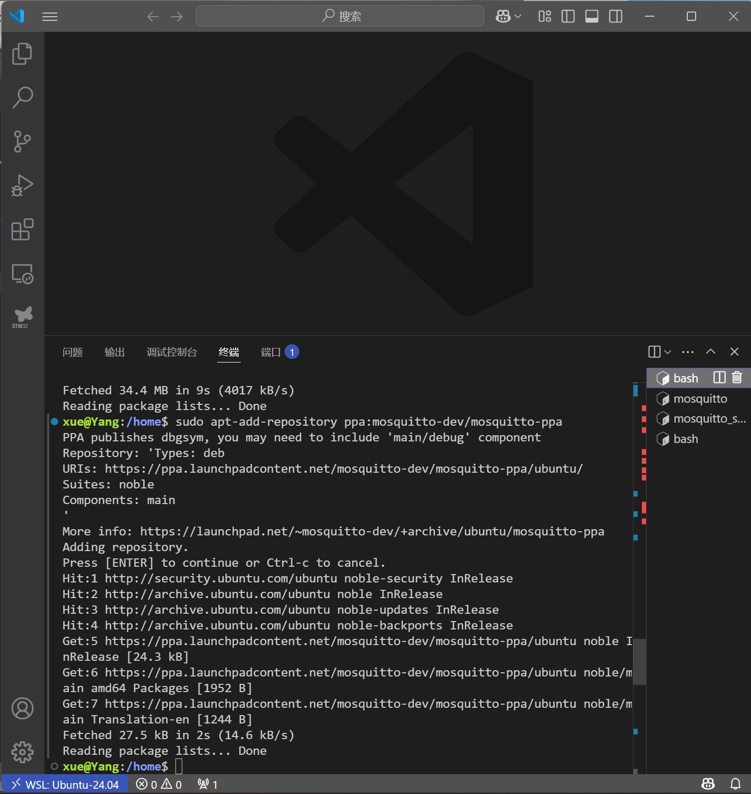
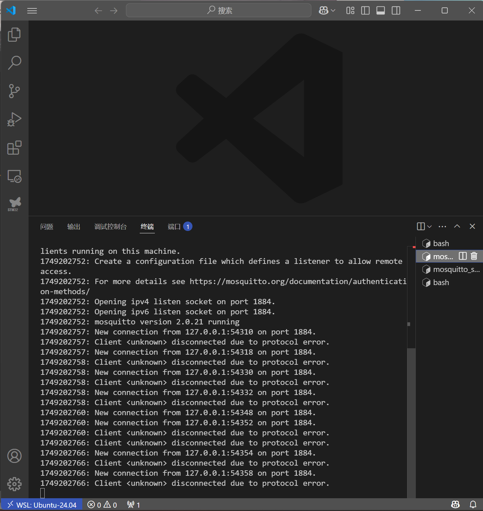
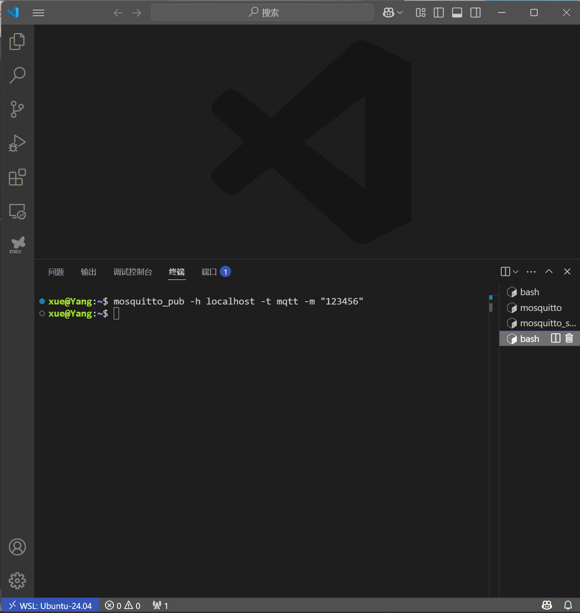
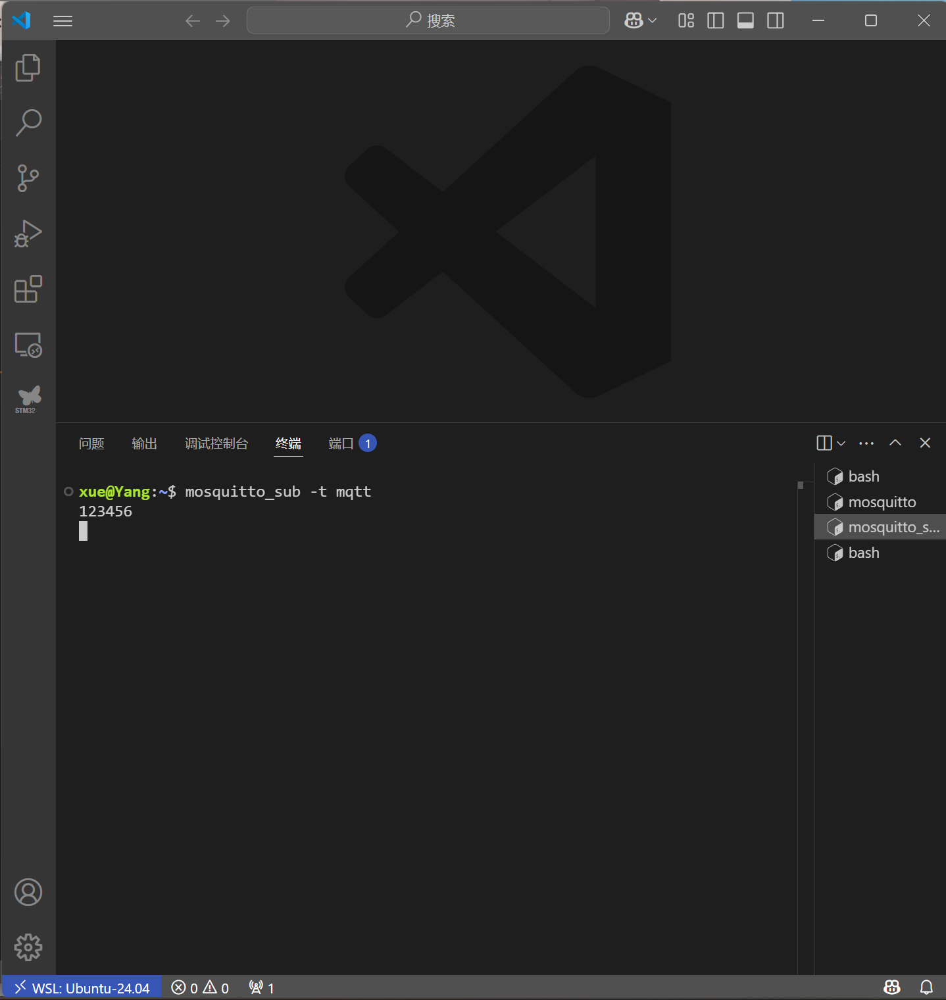

## 本周学习内容
### 组播
- 概念：对特定主机进行通信
### 发送端设置
- 创建通信套接字socket()
- 填充组播信息结构体`sockaddr_in`
- 设置组播属性使用设置函数`setsockopt()`将组播地址初始化到成员中
- 发送数据`sendto()`
### 接受端设置
- 创建通信套接字socket()
- 填充组播信息结构体`sockaddr_in`
- 将套接字与组播信息结构体绑定`band()`
- 设置为加入多播组`setspckopt()`
- 接受数据`recvfrom`
### 检测配置是否成功
- 使用`ping`检查组播地址是否可达
## 路由器与交换机
### 相同点
- 均用于连接多个设备，构建网络通信
- 都能根据目标地址转发数据
### 不同点
- 不同的工作层次。交换机位于数据链路层，路由器位于网络层，路由器可以处理TCP/IP协议，交换机根据MAC地址寻址。
- 交换机实在局域网内设备间进行数据交换，而路由器是在不同网络之间进行数据交换。
- 路由器可以把一个IP分配给很多主机，交换机可以把多个主机连接起来，主机有不同IP

## IGMP Snooping 互联网组管理协议嗅探
- 优化组播流量在局域网中的传输，避免组播数据泛洪到所有端口。
## MTU 最大传输单元
- 定义单次数据传输的最大帧大小。
### MQTT
- MQTT是一种基于发布/订阅模式的“轻量级”通讯协议，构建与TCP/IP协议上。主要是用于低带宽、高延迟、不稳定的网络环境，使传感器与执行器之间进行高效通讯。
- MQTT协议中有三种身份：发布者、代理服务器、订阅者。
- 发布者将数据发布到一个特定的主题，服务器接收到消息后将其转发给订阅了相应主题的订阅者。
### 搭建MQTT服务器
- 安装MQTT服务器.
- 搭建代理服务器端
- 搭建发布端
- 搭建订阅端
可以正常实现通信
## ROS
- 配置ROS环境`wget http://fishros.com/install -O fishros && . fishros`
### 主从机配置
- 查询主从机的hostname和IP地址
`ifconfig`
- 修改hosts文件，添加主机与从机的IP与主机名
`sudo gedit /etc/hosts`
- 环境变量配置
`sudo gedit ~/.bashrc`
主机在末尾添加`export ROS_MASTER_URI=http://主机名:11311
export ROS_HOSTNAME=主机名`
从机在末尾添加`export ROS_MASTER_URI=http://主机名:11311
export ROS_HOSTNAME=从机名`
- 开启roscore
- 测试环节
使用`ping`测试主从机连通情况

### 注意事项
- 从机不要运行roscore

### 创建ROS项目
#### 创建工作空间
- 创建工作空间`mkdir -p ~/catkin-ws/`
- 切换到工作空间`cd ~/catkin-ws/`
- 编译`catkin_make`
#### 创建package
- 切换到对应src文件夹`cd ~/catkin-ws/src`
- 创建package`catkin_create_pkg pub_sub_test std_msgs rospy roscpp`
  - `pub_sub_test`package命名
  - `std_msgs`标准信息，message中包含float、int、bool、array等时需要包含该软件包
  - `rospy`表示需要ROS能识别并使用python文件
  - `roscpp`表示需要ROS能识别使用并编译c++文件
- 切换到根目录`cd ..`
- 编译`catkin_make`

### 下周学习目标
- 实现ROS主从机的通信
- 掌握使用Docker容器构建项目开发环境
