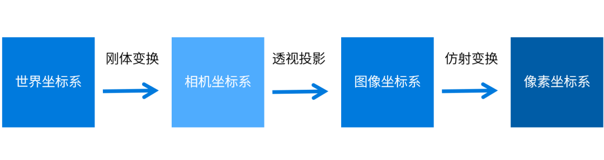

### 相机标定
#### 内参标定
目的：改善畸变、视角变换。
- 单目的标定只需要确定内参即可
- 透视投影
相机坐标系转换为图像坐标系， 
- 仿射变换
图像坐标系转换为像素坐标系
- 内参矩阵
$$\begin{bmatrix}
  \frac{f}{\mathrm{d}X} &-\frac{f\cot \theta }{\mathrm{d}X}   &u_{0}   & 0\\
 0 &  \frac{f }{\mathrm{d}Y\sin \theta} &v_{0}& 0\\
 0 & 0 & 1 & 0
\end{bmatrix}$$
透视矩阵乘仿射变换矩阵的矩阵，其中,$f$为像距,$dX$$dY$分别表示$X$$Y$方向上的一个像素在相机感光板上的物理长度（即一个像素在感光板上是多少毫米），$u_{0}$ $v_{0}$分别表示相机感光板中心在像素坐标系下的坐标，$\theta$表示感光板的横边和纵边之间的角度
#### 外参标定
目的：将世界坐标系转换到像素坐标系
- 双目相机需要考虑外参的标定

- 外参矩阵
包括旋转矩阵和平移矢量
$$
\begin{bmatrix}
 R & T\\
 0 & 1
\end{bmatrix}
$$
$R$为旋转矩阵，$T$为平移矢量