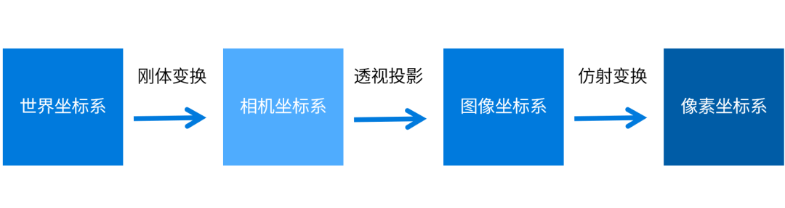

## Linux相关知识
### 修改linux分辨率
- `sudo su root`进入root模式
- `vim /etc/default/grub`
- `#GRUB_GFXMODE=640x480`在文档中修改
- `sudo update-grub`更新设置
- 重启电脑
### linux下安装应用
- `sudo apt install ./applicationname`
## ROS
MQTT与ROS的区别：数据量的区别
## Docker
### 虚拟机与Docker的区别
- 目的是为了与主机环境进行隔离
- Docker更便于移植
### Dockerfile

### 了解数据格式与通信格式
- probuff
- json
### 相机标定

#### 内参标定
目的：改善畸变、视角变换。
- 单目的标定只需要确定内参即可
#### 外参标定
- 双目相机需要考虑外参的标定，标定世界坐标系到像素坐标系