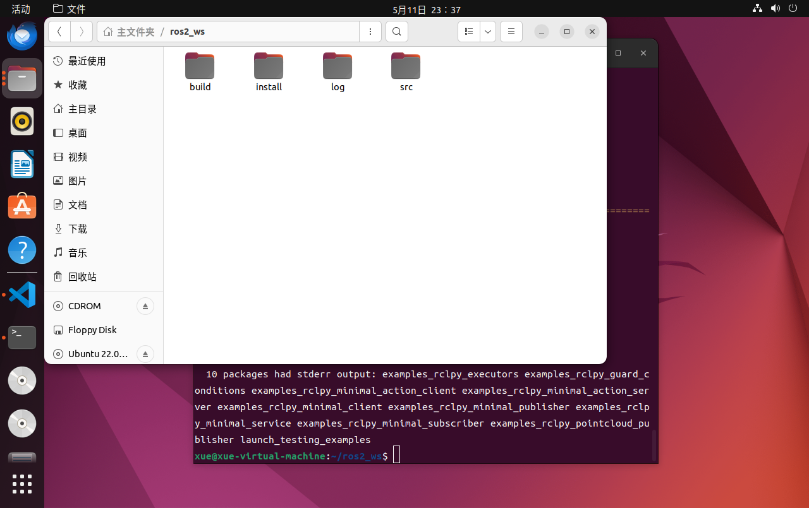
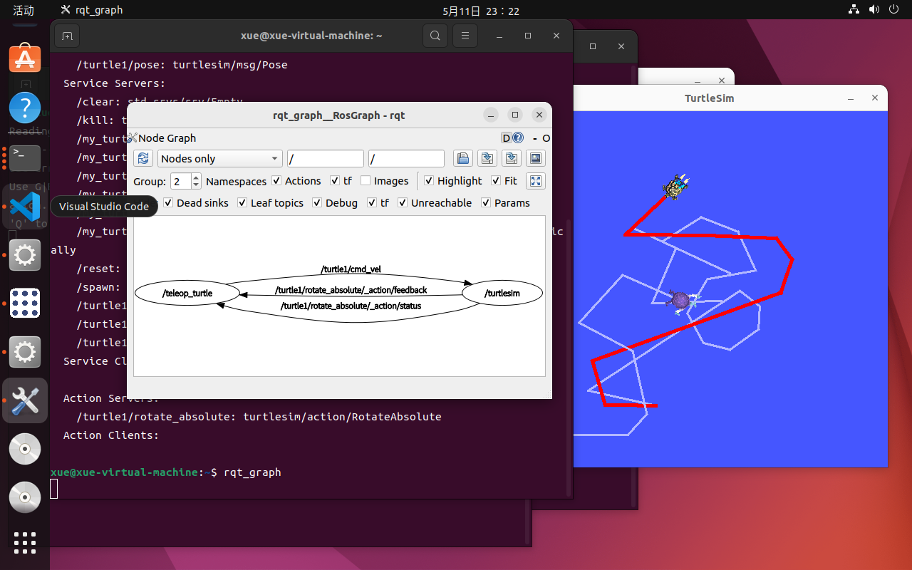
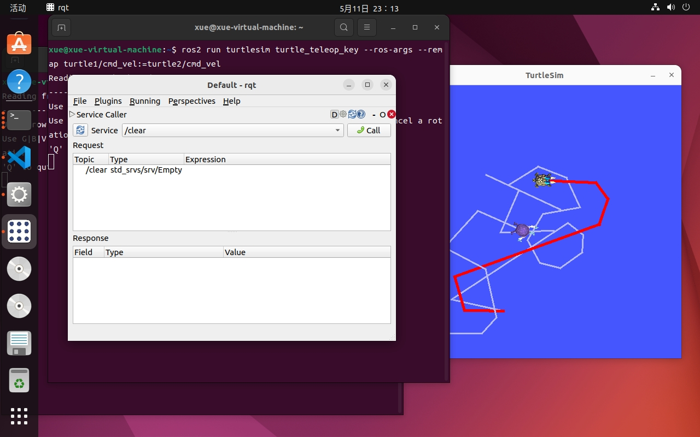

本周学习内容
#### ROS
主要学习了ROS-Academy-for-Beginners
- 工作空间
    - src（代码空间）
    - build（编译空间）
    - devel（开发空间）
    - install（安装空间）
- 创建工作空间
    - `mkdir -p workspace_name/src`创建代码空间
    - `cd workspace_name/src`
    - `catkin_init_workspace`初始化工作空间
    - `catkin_make`创建编译空间
    - `catkin_make install` 创建安装空间
- 使用colcon创建工作空间
    - `colcon build --symlink-install`
    
- 使用rqt_graph查看节点关系

- 使用rqt

监视当前话题

